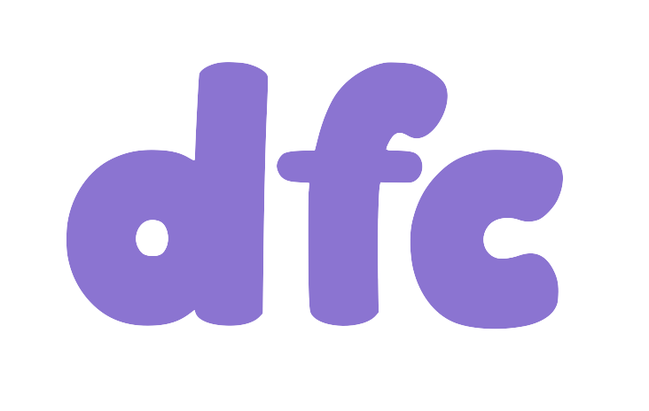

# dfc

<p align="center">

</p>

<p align="center">
"Dockerfile Converter" CLI to port existing Dockerfiles to use Chainguard Images
</p>

---

#### Supported platforms:

| OS                           | Package manager            |
| ---------------------------- | -------------------------- |
| Alpine ("alpine")            | `apk`                      |
| Debian/Ubuntu ("debian")     | `apt-get` / `apt`          |
| Fedora/RedHat/UBI ("fedora") | `yum` / `dnf` / `microdnf` |

## Usage

Run the following to convert a Dockerfile:
```sh
dfc ./Dockerfile > ./Dockerfile.converted
```

You can also pipe from stdin:
```sh
cat ./Dockerfile | dfc
```

The following CLI flags are also available:

- `--org=<org>` - the registry namespace, i.e. `cgr.dev/<org>/` (default placeholder: `ORGANIZATION`)
- `--json` - serialize Dockerfile as JSON
- `--in-place` / `-i` - modify the Dockerfile in place vs. printing to stdout, saving original in a `.bak` file

## Install

*System Requirements: Go*

One-liner to install repo while it is still private:

```sh
(git clone --depth=1 git@github.com:chainguard-dev/dfc.git dfc-tmp && \
    cd dfc-tmp && go install . && dfc --help && cd .. && rm -rf dfc-tmp)
```

..and once we make the repo public:

```sh
go install github.com/chainguard-dev/dfc@latest
```

## Examples

Convert a single `FROM` line:

```sh
echo "FROM node" | dfc
# Converts to: FROM cgr.dev/ORGANIZATION/node:latest-dev
#              USER root
```

Convert a single `RUN` line:

```sh
echo "RUN apt-get update && apt-get install -y nano" | dfc
# Converts to: RUN apk add -U nano
```

Convert a whole Dockerfile:

```sh
cat <<DOCKERFILE | dfc
FROM node
RUN apt-get update && apt-get install -y nano
DOCKERFILE
# Converts to: FROM cgr.dev/ORGANIZATION/node:latest-dev
#              USER root
#              RUN apk add -U nano
```

## How it works

`dfc` works by making very minimal modifications to your Dockerfile.

### `FROM` line modifications

For each `FROM` line in the Dockerfile, `dfc` attempts to replace the base image with an equivalent Chainguard Image.

### `RUN` line modifications

For each `RUN` line in the Dockerfile, `dfc` attempts to detect the use of a known package manager (e.g. `apt-get` / `yum` / `apk`) and extracts the names of any packages being installed.

`dfc` then attempts to map these packages to Chainguard equivalent APKs, defaulting to the existing names. All existing package manager commands are then removed and replaced with `apk add -U <packages>`.

Any `RUN` lines (or parts of lines) which are specific to package managers but not identified as the primary install command (e.g. `apt-get update`) are simply removed.

### `USER` line modifications

As described above, if `dfc` has injected a new `apk add` command into a Dockerfile line, this requires the root user.

Due to this, `dfc` will add a new line `USER root` just prior to the line running `apk`.

If a previous `USER` line is found in the same stage, then another line will be added after all injected `apk add` commands and revert back to that user (e.g. `USER nonroot`).

## Project layout

If you're here to improve/contribute something or are therwise interested in the
source code, here is the basic project layout:

- [`internal/`](./internal/)
- - [`shellparse/`](./internal/shellparse/)
- - - [`shell.go`](./internal/shellparse/shell.go) Internal methods for parsing shell from RUN lines
- - - [`shell_test.go`](./internal/shellparse/shell_test.go) Testing of shell parsing
- [`pkg/`](./pkg/)
- - [`dfc/`](./pkg/dfc/)
- - - [`convert.go`](./pkg/dfc/convert.go) Internal methods for converting images/packages
- - - [`dfc.go`](./pkg/dfc/dfc.go) Public types/methods for using dfc from Go
- - - [`dfc_test.go`](./pkg/dfc/dfc_test.go) Testing of Dockerfile conversion
- - - [`parse.go`](./pkg/dfc/parse.go) Internals methods for parsing raw Dockefiles
- [`main.go`](./main.go) Primary CLI entrypoint

## Using from Go

Source: [`examples/go/main.go`](./examples/go/main.go)

```go
package main

import (
	"context"
	"fmt"
	"log"
	"strings"

	"github.com/chainguard-dev/dfc/pkg/dfc"
)

var (
	raw = []byte(strings.TrimSpace(`
		FROM node
		RUN apt-get update && apt-get install -y nano
	`))

	org = "example.com"
)

func main() {
	ctx := context.Background()

	// Parse the Dockefile bytes
	dockerfile, err := dfc.ParseDockerfile(ctx, raw)
	if err != nil {
		log.Fatalf("ParseDockerfile(): %v", err)
	}

	// Convert
	converted := dockerfile.Convert(ctx, dfc.Options{
		Organization: org,
	})

	// Print converted Dockerfile content
	fmt.Println(converted)
}
```

## Why not use moby/buildkit?

The first version of this project used [moby/buildkit](https://github.com/moby/buildkit)
as a dependency for parsing Dockerfiles, for example:

```go
package main

import (
	"fmt"
	"os"

	"github.com/moby/buildkit/frontend/dockerfile/parser"
)

func main() {
	path := os.Args[1]
	file, _ := os.Open(path)
	d, _ := parser.Parse(file)
	fmt.Println(d.AST.Dump())
}
```

However, after using this library for a while, it became clear that this would not
meet the needs of the project primarily for the following reasons:

- The `Result` type returned by `parser.Parse` did not properly maintain whitespace or comments
- The `Dump()` method returned a custom output format that was not valid Dockerfile

Although it properly extracted the valid Dockerfile commands, it was difficult to
actually reconstruct the Dockerfile after it was parsed. It also did not do in-depth
parsing of shell code inside `RUN` lines required to properly evaluate certain package manager commands (e.g. `apt-get install`).

Due to all of the above, buildkit was later dropped as a dependency. Instead, custom parsers for both Dockerfiles and shell code were implemeted that are highly tailored to the specific needs of this tool.
