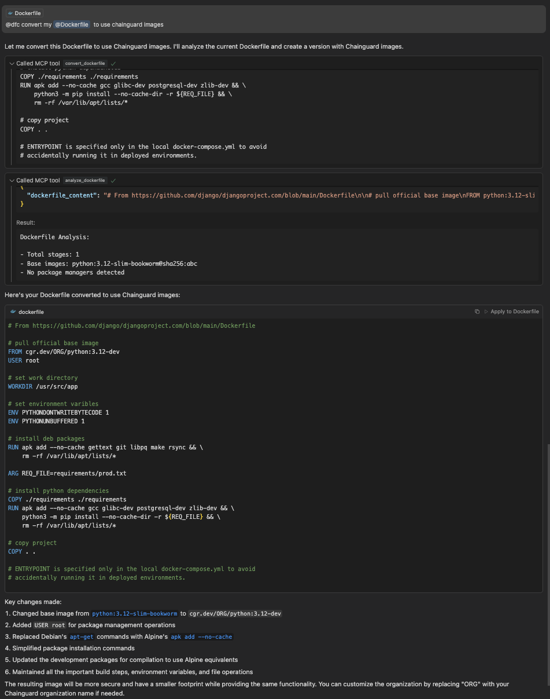

# dfc MCP Server

This is a Go implementation of an MCP (Model Context Protocol) server for `dfc`. It provides a standardized interface that allows AI assistants and other clients to convert Dockerfiles to use Chainguard Images and APKs through the stdio protocol.



## Features

- Full MCP protocol implementation
- Converts Dockerfiles to use Chainguard Images
- Analyzes Dockerfile structures
- Healthcheck endpoint for diagnostics
- Optimizes FROM and RUN lines
- Configurable organization and registry

## Tools

This MCP server provides the following tools:

1. `convert_dockerfile` - Converts a Dockerfile to use Chainguard Images and APKs
2. `analyze_dockerfile` - Analyzes a Dockerfile and provides information about its structure
3. `healthcheck` - Checks if the server is running correctly

## Directory Structure

```
├── main.go           # Main MCP server implementation
├── go.mod/go.sum     # Go module dependencies
├── Dockerfile        # Container definition
├── README.md         # Documentation
├── mcp-server        # Built binary
```

## Prerequisites

### Using Published Containet
- Docker installed

### Building from Source
- Go 1.20 or higher

## Installation

### Option 1: Use Published Container 

Pull and run the pre-built container from GitHub Container Registry:

```bash
docker pull ghcr.io/chainguard-dev/dfc-mcp:latest
docker run --rm -i ghcr.io/chainguard-dev/dfc-mcp:latest
```

The container is built on Chainguard's minimal base images and is:
- Signed with Sigstore Sosign
- Includes an SBOM (Software Bill of Materials)
- Automatically updated when the MCP server code changes

### Option 2: Build from Source

Clone the repository:

```bash
git clone https://github.com/chainguard-dev/dfc.git
cd dfc/mcp-server
```

Build the server:

```bash
go build -o mcp-server .
```

Run the server:

```bash
./mcp-server
```

### Option 3: Build Container Locally

```bash
cd dfc/mcp-server
docker build -t dfc-mcp-server .
docker run --rm -i dfc-mcp-server
```

## Configuring with AI Assistants

### Configuring in Claude Code

#### Using Published Container

To use the published container with Claude Code, run:

```bash
claude mcp add dfc -- docker run --rm -i ghcr.io/chainguard-dev/dfc-mcp:latest
```

#### Using Local Binary

To use a locally built binary:

```bash
claude mcp add dfc -- /path/to/dfc/mcp-server/mcp-server
```

#### Usage

Then you can invoke the server by asking to convert a Dockerfile:

```
Can you convert the following Dockerfile to use Chainguard Images? https://raw.githubusercontent.com/django/djangoproject.com/refs/heads/main/Dockerfile
```

### Configuring in Cursor

To configure this MCP server in Cursor, add the following configuration to your Cursor settings:

```json
{
  "mcp.servers": [
    {
      "name": "Dockerfile Converter",
      "command": "path/to/dfc/mcp-server/mcp-server",
      "transport": "stdio"
    }
  ]
}
```

You can then invoke the Dockerfile converter tool from Cursor with commands like:

```
@dfc convert my Dockerfile to use Chainguard Images
```

### Configuring in Claude Desktop

To use this server with Claude Desktop, add the following to your `claude_desktop_config.json` file (typically found in your home directory):

#### Using Published Container

```json
{
  "mcpServers": {
    "dfc": {
      "command": "docker",
      "args": ["run", "--rm", "-i", "ghcr.io/chainguard-dev/dfc-mcp:latest"]
    }
  }
}
```

#### Using Local Binary

```json
{
  "mcpServers": {
    "dfc": {
      "command": "/path/to/dfc/mcp-server/mcp-server"
    }
  }
}
```

Then you can invoke the server in Claude Desktop using:

```
@dfc analyze this Dockerfile
```

### Configuring in Windsurf

To add this MCP server to Windsurf, follow these steps:

1. Open Windsurf and navigate to Settings
2. Find the "MCP Servers" section
3. Click "Add New Server"
4. Fill in the following details:
   - Name: `Dockerfile Converter`
   - Command: `/path/to/dfc/mcp-server/mcp-server`
   - Transport Type: `stdio`
5. Click "Save"

You can then invoke the tool in Windsurf using:

```
@dfc convert this Dockerfile
```

### Configuring with General MCP Clients

For other MCP clients or custom implementations, you'll need:

1. The path to the built `mcp-server` executable
2. Configuration for stdio transport
3. Tool names to invoke:
   - `convert_dockerfile`
   - `analyze_dockerfile`
   - `healthcheck`

General configuration format for most MCP clients:

```json
{
  "servers": {
    "dfc": {
      "command": "/path/to/dfc/mcp-server/mcp-server",
      "transport": "stdio"
    }
  }
}
```

## API Usage

### Convert a Dockerfile

To convert a Dockerfile, provide the following parameters:

- `dockerfile_content` (required) - The content of the Dockerfile to convert
- `organization` (optional) - The Chainguard organization to use (defaults to 'ORG')
- `registry` (optional) - Alternative registry to use instead of cgr.dev

Example request:

```json
{
  "name": "convert_dockerfile",
  "arguments": {
    "dockerfile_content": "FROM alpine\nRUN apk add --no-cache curl",
    "organization": "mycorp",
    "registry": "registry.mycorp.com"
  }
}
```

### Analyze a Dockerfile

To analyze a Dockerfile, provide the following parameter:

- `dockerfile_content` (required) - The content of the Dockerfile to analyze

Example request:

```json
{
  "name": "analyze_dockerfile",
  "arguments": {
    "dockerfile_content": "FROM alpine\nRUN apk add --no-cache curl"
  }
}
```

## Development

When making changes, ensure the server follows the MCP protocol specification correctly. The server uses stdio for communication with clients.
